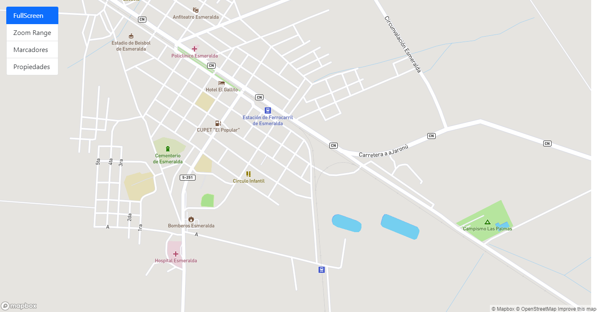
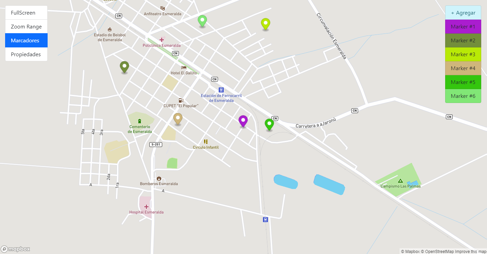
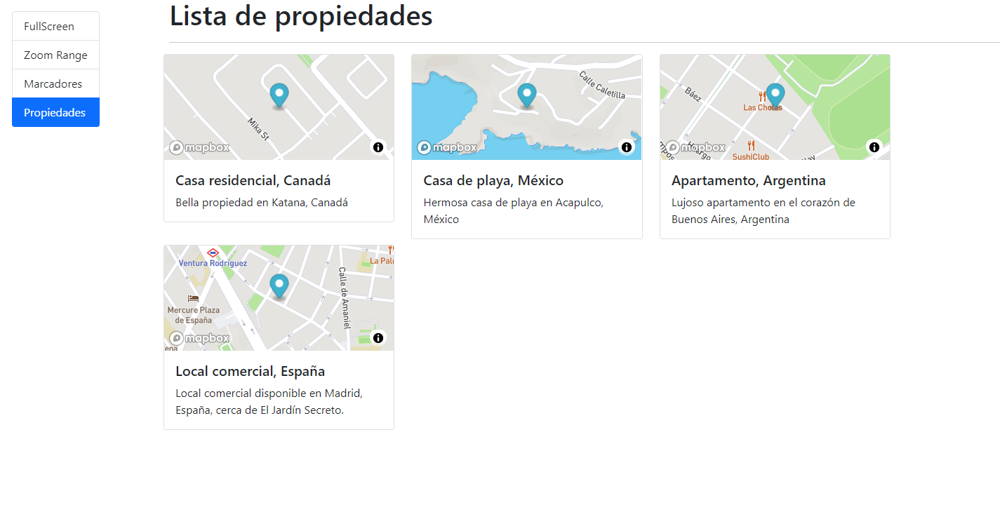

# Mapbox with Angular
[](https://github.com/gcristia/Mapbox-with-Angular/blob/main/README.md)
[](https://github.com/gcristia/Mapbox-with-Angular/blob/main/README.es.md)

Using Mapbox with Angular

### Pre-requisitos 📋
* Instalar todas las dependencias necesarias
``` 
npm install
```

## Servidor de desarrollo 🔧
Ejecute `ng serve` para un servidor de desarrollo. Vaya a `http: // localhost: 4200 /`. La aplicación se recargará automáticamente si cambia alguno de los archivos de origen.

## Construyendo el proyecto 🛠️
Ejecute `ng build` para construir el proyecto. Los artefactos de construcción se almacenarán en el directorio `dist /`.

### Algunas Capturas
<p align="center" width="100%">
     
     
     
     
</p> 

## Expresiones de gratitud 🎁
* Estoy muy agradecido por todo lo que aprendí en el curso [Angular De cero a experto – ( Edición 2021 )](https://www.udemy.com/course/angular-2-fernando-herrera) impartido por [Fernando Herrera](https://fernando-herrera.com/)
---
⌨️con ❤ por [gcristia](https://github.com/gcristia) 😊 
