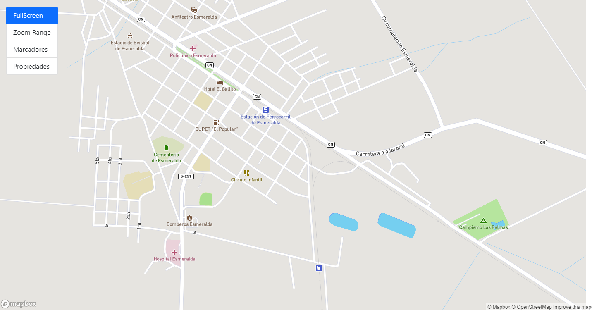
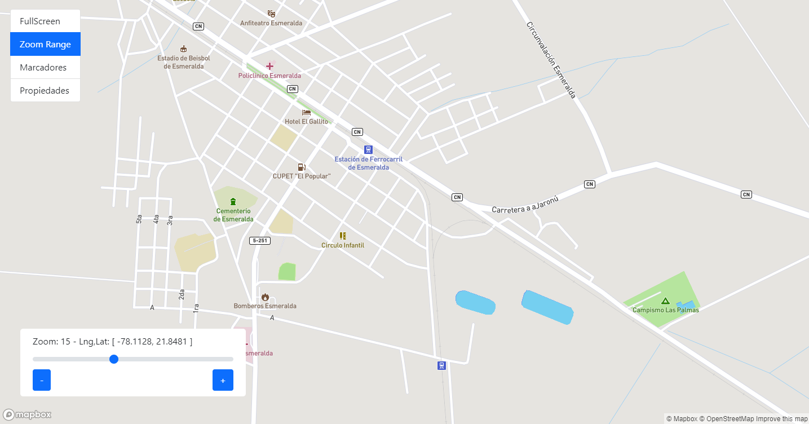
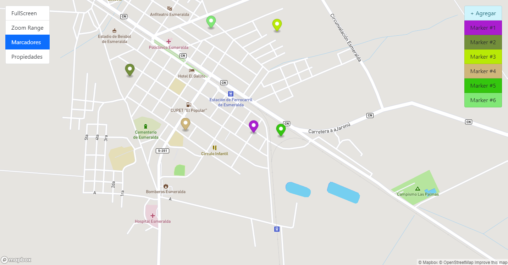
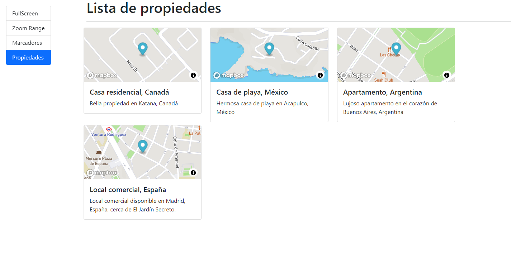

# Mapbox with Angular

Using Mapbox with Angular

## Development server
Run `ng serve` for a dev server. Navigate to `http://localhost:4200/`. The app will automatically reload if you change any of the source files.

## Build
Run `ng build` to build the project. The build artifacts will be stored in the `dist/` directory.

### Some Screenshots

     
     
     
     

 

## Expressions of Gratitude 🎁
* I am very grateful for everything I learned in the course [Angular De cero a experto – ( Edición 2021 )](https://www.udemy.com/course/angular-2-fernando-herrera) made by [Fernando Herrera](https://fernando-herrera.com/)
---
⌨️ with ❤️by [gcristia](https://github.com/gcristia) 😊 
